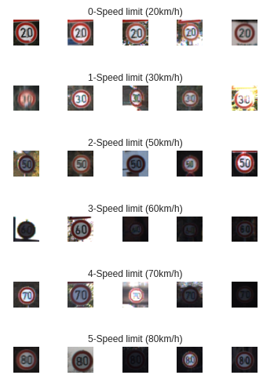

# traffic_signs

The purpose of the repository is to create a LeNet convolutional neural network to classify images of road signs. 

The steps are:

## 1. Import machine learning modules

This neural network primarily uses `keras` models and optimizers. It also uses `pickle` and `pandas` for working with the data.

## 2. Import labelled image data

The labelled image data is imported from the link at the end of this README. This is a dataset of 34799 images over 42 different categories of traffic signs, 10 of which are shown below.

__Figure 1: Training Images__

 

## 3. Preprocess + Augment road signs

The next step is to preprocess the road signs. This includes grayscale conversion, histogram equalization, and normalization.

__Figure 2: Preprocessed Image__

To improve the robustness of the model and augment our dataset, we perform image augmentation techniques including translation, zoom, and rotation.

__Figure 3: Augmented Images__

## 4. Create a LeNet model

The next step is to create the LeNet model. This includes `four convolutional layers` with relu activation, `two pooling layers`, and `two Dense Layers` with relu and softmax activations, respectively.

## 5. Test the LeNet model

The LeNet model takes about 1 minute per epoch to train, which means a total of 10 minutes for 10 epochs.

Shown below are the Loss and Accuracy Plots of the training data and validation data. The result is a model with __97.5%__ accuracy on unseen testing data.

__Figure 4: Training and Validation Loss__

__Figure 5: Training and Validation Accuracy__

To ensure that the model works on other images, we test that it works on different images found on the internet. It successfully identified all of them. Below is an example of the Bike Crossing image that was correctly classified.

__Figure 6: Non-Training Image__

__Figure 7: Preprocessed Non-Training Image__

## Traffic Sign Labelled Image Data

https://bitbucket.org/jadslim/german-traffic-signs

## How to Use

This code is intended to be run on Google Colab as a Python 3 Notebook, as the model fitting is faster with GPU processing. 

Press `Runtime`> `Change runtime type` > `Hardware Accelerator` > `GPU` to improve the runtime signficantly.
